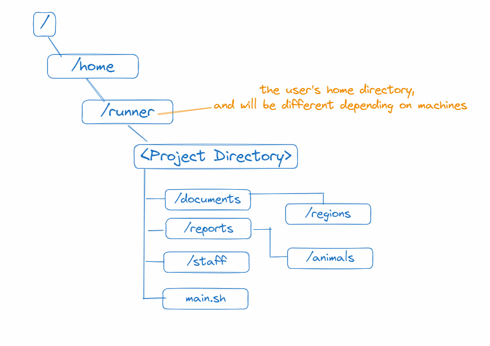

Q1
Open up the shell and type in pwd. Copy and paste in the box the path. This is the project directory. 

Q2 
In the shell, create a new directory with the name start. Write the command below:

Q3
Making sure that you are in the project directory (see Q1). Switch to the start directory using relative file path.

Q4
Make sure your current working directory is the start directory. From the start directory, change the current working directory to the countries directory using relative file paths. Write down the command to do so below:

Q5
From the countries directory, how do you get to the regions directory? Use relative file paths in your answer.

Q6
From the regions directory, how do you get to the animals directory? Use relative file paths in your answer.

Q7
In the directory from the last question (the animals directory in reports), using the terminal, create a new file without using the mouse named "readme.txt" in the malaysia directory. See if you can achieve this with one command, using relative file path.

Q8
Type cd ~ and from there, go to the start directory created in Q2. From there, switch to the directory that contains the readme.txt file in the malaysia directory.

Q9
Continuing from question 8, using relative file path, switch to the nature directory.

Q10
Write down the absolute file path to the somethinghere.txt file the west directory:

Q11
In the start directory, use a Linux command to move the somethinghere.txt file from the west directory to the east directory

Q12
In the start directory that you have created in Q2, then using the appropriate Linux command and relative file path, delete the east directory which is inside regions.

